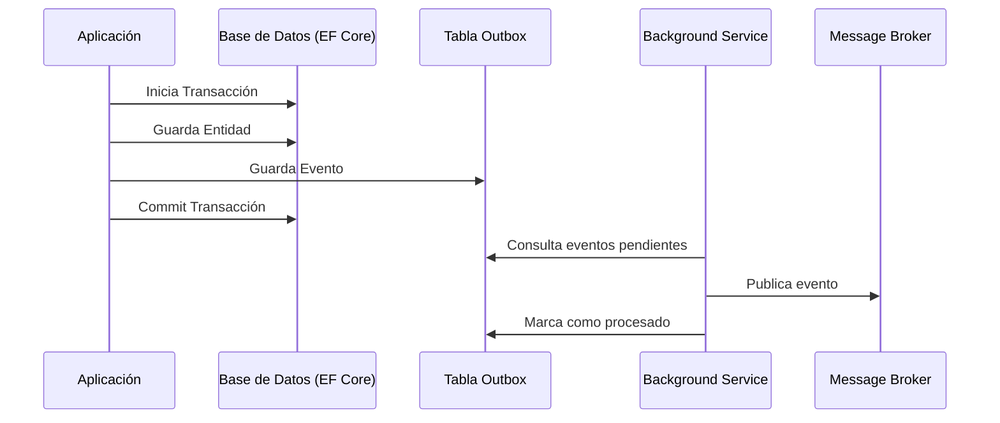

# Transactional Outbox Pattern [Semi-Senior]

## 1. Contexto General & Definición del Concepto
El patrón **Transactional Outbox** resuelve el problema de la atomicidad cuando debemos actualizar una base de datos y publicar un evento en un sistema de mensajería (como RabbitMQ o Kafka) de forma simultánea. Sin este patrón, es común caer en inconsistencias donde la DB se actualiza pero el mensaje nunca se envía (o viceversa).

## 2. Forma de Aplicación, Buenas Prácticas & Ventajas
Se aplica cuando el sistema requiere consistencia eventual. Es vital evitar el "Dual Write" (escribir en DB y llamar a un API externa en el mismo scope de transacción).

| Ventaja | Desventaja |
| :--- | :--- |
| Consistencia garantizada | Aumento de complejidad en infraestructura |
| Resiliencia ante caídas de red | Necesita un worker de procesamiento (poller) |
| Desacoplamiento de servicios | Latencia añadida en el despacho del evento |

## 3. Flujo Arquitectónico


## 4. Implementación en C# .NET 10
Utilizamos un `DbContext` para incluir el evento en la misma transacción.

```csharp
public record OrderCreatedEvent(Guid OrderId, decimal Amount);

public async Task CreateOrder(Order order) {
    using var transaction = await _dbContext.Database.BeginTransactionAsync();
    try {
        _dbContext.Orders.Add(order);
        _dbContext.OutboxMessages.Add(new OutboxMessage {
            Type = nameof(OrderCreatedEvent),
            Payload = JsonSerializer.Serialize(new OrderCreatedEvent(order.Id, order.Total)),
            OccurredOn = DateTime.UtcNow
        });
        await _dbContext.SaveChangesAsync();
        await transaction.CommitAsync();
    } catch { await transaction.RollbackAsync(); throw; }
}
```

## 5. Implementación en React con Vite.js
En el frontend, la resiliencia se maneja mediante estados y reintentos automáticos para evitar duplicidad.

```tsx
import { useState } from 'react';

export const useOrderSubmission = () => {
  const [loading, setLoading] = useState(false);
  const submitOrder = async (data: OrderDto) => {
    setLoading(true);
    try {
      const response = await fetch('/api/orders', { method: 'POST', body: JSON.stringify(data) });
      if (!response.ok) throw new Error('Error al procesar orden');
      // UI optimista: el sistema de mensajería procesará async
    } catch (err) {
      console.error(err);
    } finally { setLoading(false); }
  };
  return { submitOrder, loading };
};
```

## 6. Consideraciones de Concurrencia
Al usar este patrón, el sistema es **eventualmente consistente**. El frontend no debe esperar el procesamiento del mensaje para mostrar éxito al usuario; en su lugar, se recomienda utilizar WebSockets o Polling para notificar el estado final del procesamiento del outbox.

## 7. Enlaces y Referencias
- [[Clean-Architecture-Fundamentos]]
- [[EF-Core-DbContext-Pattern]]
